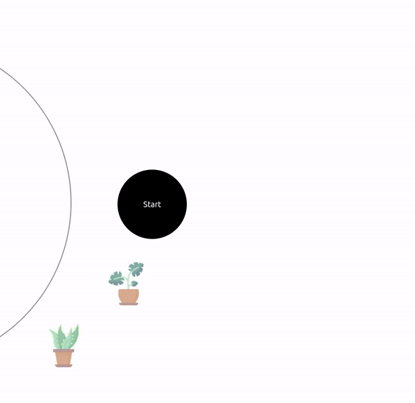
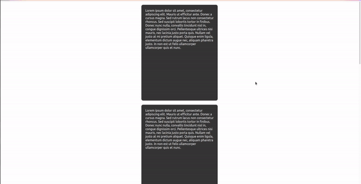

# advAnimations

## Table of Contents

- [Installation](#installation)
- [Usage](#usage)
  - [Circular List](#circular-list)
  - [Stacked Card Carousel](#stacked-card-carousel)
  - [Carousel](#carousel)
  - [Accordion Gallery](#accordion-gallery)

# Installation

```
npm install advAnimations
```

# Usage

## Circular List

```tsx
<CircularList
  list={list}
  showBorder={true}
  backgroundColor="#0000"
  textColor="#ffffff"
/>
```

### Props

| Name            | Value                | Description                                                                                                                                                                                                                                                                                                                                                                                |
| --------------- | -------------------- | ------------------------------------------------------------------------------------------------------------------------------------------------------------------------------------------------------------------------------------------------------------------------------------------------------------------------------------------------------------------------------------------ |
| list            | `CircularListItem[]` | List of items to be displayed. Each _CircularListItem_ is of the shape `{ id: number, value: string, path: string }` where _id_ is the unique id of the item, _value_ is the text to be displayed, and _path_ is the path of image to be displayed. _path_ is optional in it, if it is not given then the text given in _value_ will be displayed otherwise the picture will be displayed. |
| showBorder      | `boolean`            | Displays/hides the circle border.                                                                                                                                                                                                                                                                                                                                                          |
| backgroundColor | `string`             | Sets the background color of text item. It is optional.                                                                                                                                                                                                                                                                                                                                    |
| textColor       | `string`             | Sets the text color of the text item. It is optional.                                                                                                                                                                                                                                                                                                                                      |

### Demo



## Stacked Card Carousel

```tsx
<StackedCardCarousel
  cardsContent={cardsList}
  cardsBackgroundColor="#353535"
  cardsContentColor="#fff"
/>
```

### Props

| Name                 | Value         | Description                              |
| -------------------- | ------------- | ---------------------------------------- |
| cardsContent         | `ReactNode[]` | Content to be displayed inside each card |
| cardsBackgroundColor | `string`      | Defines the card's background color      |
| cardsContentColor    | `string`      | Defines the card's content text color    |

### Demo



## Carousel

```tsx
<Carousel imagePaths={imagePaths} autoplay={true} interval={3000} />
```

### Props

| Name       | Value      | Description                                                                      |
| ---------- | ---------- | -------------------------------------------------------------------------------- |
| imagePaths | `string[]` | Paths of the images to display                                                   |
| autoplay   | `boolean`  | Changes the slides automatically after the time interval mentioned in `interval` |
| interval   | `number`   | Interval in miliseconds when `autoPlay` is set to `true`                         |

### Demo


## Accordion Gallery

```tsx
<AccordionGallery imagePaths={imagePaths} />
```

### Props

| Name       | Value      | Description                    |
| ---------- | ---------- | ------------------------------ |
| imagePaths | `string[]` | Paths of the images to display |

### Demo


